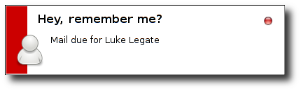

Usage
-----

:program:`blanco.py` supports writing to standard output or using popup
notifications.

.. code-block:: sh

    Ξ Desktop/blanco git:(master) ▶ blanco.py
    Mail due for Luke Legate
    Ξ Desktop/blanco git:(master) ▶

If the :option:`--notify <-n>` option is specified popups will be displayed on
the desktop, see the example below.

The :option:`--notify <-n>` mode is specifically meant from a desktop startup
sequence, and that is how :mod:`blanco`'s author normally uses it.

Options
'''''''

.. program:: blanco.py

.. option:: -a, --addressbook FILENAME
    Address book to read contacts from.

.. option:: -t, --sent-type [mailbox|msmtp]
    Sent source type.

.. option:: -r, --all / --no-all
    Include all recipients(CC and BCC fields).

.. option:: -m, --mbox FILENAME
    Mailbox used to store sent mail.

.. option:: -l, --log FILENAME
    msmtp log to parse.

.. option:: -g, --gmail / --no-gmail
    Log from a gmail account(use accurate filter).

.. option:: -s, --field TEXT
    Addressbook field to use for frequency value.

.. option:: -n, --notify / --no-notify
    Display reminders using notification popups.

.. option:: -v, --verbose / --no-verbose
    Produce verbose output.

.. option:: --version
    Show the version and exit.

.. option:: --help
    Show this message and exit.
